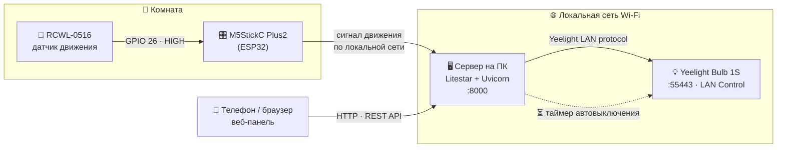

<div align="center">

# 🏠 My Clever Home

**Умный дом своими руками: свет, который включается сам.**

Датчик движения на ESP32 ловит человека в комнате → отправляет пакет на сервер →
сервер зажигает Yeelight-лампу и заводит таймер автовыключения.

<br>

[](https://www.python.org/)
[](https://litestar.dev/)
[](https://docs.astral.sh/uv/)
[](https://docs.m5stack.com/en/core/M5StickC%20PLUS2)
[](https://www.yeelight.com/)

</div>

---

## 📋 Содержание

- [Что это такое](#-что-это-такое)
- [Как это работает](#-как-это-работает)
- [Железо](#-железо)
- [Стек и библиотеки](#-стек-и-библиотеки)
- [Быстрый старт](#-быстрый-старт)
- [API](#-api)
- [Структура проекта](#-структура-проекта)
- [История версий](#-история-версий)
- [Известные ограничения](#-известные-ограничения)
- [Дорожная карта](#-дорожная-карта)

---

## 💡 Что это такое

Домашний pet-проект по автоматизации освещения в комнате. Микроконтроллер с
СВЧ-датчиком движения висит на стене, компьютер работает как сервер, лампа
Yeelight управляется по локальной сети — без облака производителя.

Сейчас проект живёт в **третьей итерации** — веб-сервер на [Litestar](https://litestar.dev/)
с REST API и веб-панелью, доступной с телефона из домашней Wi-Fi сети.
Предыдущие версии (MQTT и «сырой» UDP) сохранены в [`src/versions_old/`](src/versions_old)
как рабочая история проекта.

---

## ⚙️ Как это работает



**Сценарий по шагам:**

1. `RCWL-0516` реагирует на движение и поднимает пин в `HIGH`.
2. ESP32 читает пин и отправляет сигнал серверу по локальной сети.
3. Сервер включает лампу и **сбрасывает таймер** автовыключения.
4. Пока в комнате есть движение — таймер сбрасывается снова и снова.
5. Движение прекратилось → таймер дотикал → свет гаснет.

Параллельно тем же светом можно управлять руками — с веб-страницы в браузере
или из меню на экране M5StickC.

---

## 🔩 Железо

| Компонент | Модель | Роль | Заметки |
|:--|:--|:--|:--|
| 🎛️ Микроконтроллер | [M5StickC Plus2](https://docs.m5stack.com/en/core/M5StickC%20PLUS2) (ESP32) | Читает датчик, шлёт команды, показывает меню | Экран 240×135, кнопки `A`, `B` и `PWR` |
| 📡 Датчик движения | [RCWL-0516](https://github.com/jdesbonnet/RCWL-0516) | Детекция присутствия | СВЧ-доплер, ловит движение **сквозь стены**, ≈107 ₽ |
| 💡 Лампа | [Yeelight Smart Bulb 1S](https://www.yeelight.com/) | Собственно свет | Управление по локалке, порт `55443` |
| 🖥️ Сервер | Любой ПК / мини-ПК в той же сети | Логика, таймеры, API, веб-панель | Python 3.13+ |

> [!IMPORTANT]
> Чтобы лампа слушалась по локальной сети, в приложении Yeelight нужно включить
> **LAN Control**. В свежих версиях приложения эту кнопку убрали — помогает
> установка старой версии приложения и смена региона аккаунта
> (подробности — в [`docs/`](docs)).

---

## 📚 Стек и библиотеки

### Серверная часть (Python)

| Библиотека | Зачем нужна | Ссылки |
|:--|:--|:--|
| **Litestar** | ASGI-фреймворк, на котором построен веб-сервер: маршруты, валидация, автодокументация OpenAPI, рендеринг шаблонов | [сайт](https://litestar.dev/) · [документация](https://docs.litestar.dev/) · [GitHub](https://github.com/litestar-org/litestar) |
| **Uvicorn** | ASGI-сервер, который непосредственно запускает приложение и держит HTTP-соединения; в dev-режиме даёт автоперезагрузку | [сайт](https://www.uvicorn.org/) · [GitHub](https://github.com/encode/uvicorn) |
| **Pydantic** | Схемы данных и валидация тела запросов (`CommandModel`) — Litestar разбирает входящий JSON строго по типам | [документация](https://docs.pydantic.dev/) · [GitHub](https://github.com/pydantic/pydantic) |
| **Jinja2** | Шаблонизатор для HTML-страницы панели управления (`templates/index.html`) | [документация](https://jinja.palletsprojects.com/) · [GitHub](https://github.com/pallets/jinja) |
| **python-yeelight** | Клиент протокола Yeelight LAN Control: `turn_on()`, `turn_off()`, плавные переходы — без облака и интернета | [документация](https://yeelight.readthedocs.io/) · [GitHub](https://github.com/stavros/python-yeelight) |
| **uv** | Менеджер зависимостей и виртуальных окружений, фиксирует версии в `uv.lock` | [документация](https://docs.astral.sh/uv/) · [GitHub](https://github.com/astral-sh/uv) |

<details>
<summary><b>📦 Библиотеки старых версий</b> — нужны только для кода из <code>src/versions_old/</code></summary>

<br>

| Библиотека | Зачем нужна | Ссылки |
|:--|:--|:--|
| **paho-mqtt** | MQTT-клиент в версии 1: сервер подписывался на топик `room/motion` и слушал сообщения от ESP32 | [сайт](https://eclipse.dev/paho/) · [GitHub](https://github.com/eclipse-paho/paho.mqtt.python) |
| **Eclipse Mosquitto** | Сам MQTT-брокер, который приходилось поднимать отдельным процессом | [сайт](https://mosquitto.org/) · [GitHub](https://github.com/eclipse-mosquitto/mosquitto) |
| `socket`, `threading`, `json` | Версия 2 обходилась стандартной библиотекой: свой UDP-сервер, таймеры на потоках, разбор JSON-команд | [socket](https://docs.python.org/3/library/socket.html) · [threading](https://docs.python.org/3/library/threading.html) |

Этих пакетов **нет** в `pyproject.toml` актуальной версии — если захотите запустить
архивные скрипты, ставьте их отдельно (`uv pip install paho-mqtt yeelight`).

</details>

### Прошивка (Arduino / C++)

| Библиотека | Зачем нужна | Ссылки |
|:--|:--|:--|
| **M5StickCPlus2** | Работа с платой: дисплей, кнопки `BtnA` / `BtnB` / `BtnPWR`, питание | [GitHub](https://github.com/m5stack/M5StickCPlus2) · [документация](https://docs.m5stack.com/en/arduino/m5stickc_plus2/program) |
| **WiFi / WiFiUdp** | Подключение к домашней сети и отправка UDP-пакетов; входят в ядро Arduino для ESP32 | [Arduino-ESP32](https://github.com/espressif/arduino-esp32) · [документация](https://docs.espressif.com/projects/arduino-esp32/en/latest/) |
| **ArduinoJson** | Сборка JSON-команд вида `{"command":"timer","value":30}` на стороне контроллера | [сайт](https://arduinojson.org/) · [GitHub](https://github.com/bblanchon/ArduinoJson) |
| **PubSubClient** | MQTT-клиент для ESP32 — использовался в версии 1 | [GitHub](https://github.com/knolleary/pubsubclient) |

---

## 🚀 Быстрый старт

### 1. Подготовка лампы

1. Подключите лампу к домашней Wi-Fi сети через приложение Yeelight.
2. Включите **LAN Control** в настройках лампы.
3. Узнайте её IP-адрес — в приложении или в веб-интерфейсе роутера.

### 2. Запуск сервера

Понадобятся [Python 3.13+](https://www.python.org/downloads/) и [uv](https://docs.astral.sh/uv/getting-started/installation/).

```bash
git clone https://github.com/<your-user>/my-clever-home.git
```

```bash
cd my-clever-home/src/web && uv sync
```

> [!NOTE]
> IP лампы задан константой `BULB_IP` в начале файла [`src/web/app/main.py`](src/web/app/main.py) —
> подставьте туда свой адрес перед запуском.

Приложение ищет папку с шаблонами относительно текущей директории, поэтому
запускать его нужно **из каталога `app`**:

```bash
cd my-clever-home/src/web/app && uv run python main.py
```

Готово — панель управления открывается по адресу **<http://127.0.0.1:8000>**.

> [!TIP]
> Чтобы заходить с телефона, поднимите сервер на всю локальную сеть:
> ```bash
> uv run uvicorn main:app --host 0.0.0.0 --port 8000
> ```
> и откройте `http://<IP-компьютера>:8000` в браузере телефона.

### 3. Прошивка контроллера

1. Установите [Arduino IDE](https://www.arduino.cc/en/software) и [ядро ESP32](https://docs.espressif.com/projects/arduino-esp32/en/latest/installing.html).
2. Через **Менеджер библиотек** поставьте `M5StickCPlus2` и `ArduinoJson`.
3. Откройте нужный скетч из [`src/versions_old/`](src/versions_old), укажите свои
   `ssid`, `password` и `server_ip`, выберите плату **M5Stick-C-Plus2** и прошейте.
4. Подключите `RCWL-0516`: `VIN → 5V`, `GND → GND`, `OUT → GPIO 26`.

---

## 🔌 API

Сервер поднимает REST-эндпоинты под префиксом `/api/v1`:

| Метод | Путь | Что делает | Ответ |
|:--|:--|:--|:--|
| `GET` | `/` | Веб-панель управления | `text/html` |
| `GET` | `/api/v1/light` | Проверка связи с лампой | `{"msg": "Соединение есть"}` |
| `GET` | `/api/v1/light/on` | Включить свет | `{"msg": "Соединение есть"}` |
| `GET` | `/api/v1/light/off` | Выключить свет | `{"msg": "Соединение есть"}` |
| `POST` | `/api/v1/command` | Приём команды от датчика (`{"sensor": "..."}`) | эхо тела запроса |

Примеры:

```bash
curl http://127.0.0.1:8000/api/v1/light/on
```

```bash
curl -X POST http://127.0.0.1:8000/api/v1/command -H "Content-Type: application/json" -d '{"sensor":"motion"}'
```

> [!TIP]
> Litestar генерирует документацию сам — интерактивный Swagger UI живёт
> на <http://127.0.0.1:8000/schema/swagger>.

---

## 🗂 Структура проекта

```
my-clever-home/
├── docs/                             # Заметки по железу и идеи развития
│   ├── 1.txt                         #   ↳ список фич на будущее
│   └── Свет с датчиком движения.txt   #   ↳ опыт настройки Yeelight и датчика
│
├── infrastructure/                   # Зарезервировано под деплой (Docker и т.п.)
│
└── src/
    ├── web/                          # 🟢 АКТУАЛЬНАЯ ВЕРСИЯ — веб-сервер
    │   ├── app/
    │   │   ├── main.py               #   ↳ Litestar-приложение, роуты, класс SmartLight
    │   │   └── templates/
    │   │       └── index.html        #   ↳ веб-панель с кнопками вкл/выкл
    │   ├── pyproject.toml            #   ↳ зависимости проекта
    │   └── uv.lock                   #   ↳ зафиксированные версии
    │
    └── versions_old/                 # 📦 Архив предыдущих итераций
        ├── 1/                        #   ↳ v1 — связка через MQTT
        │   ├── main.py               #      сервер на paho-mqtt
        │   ├── info.txt              #      описание сборки
        │   └── sketchforEsp32/       #      прошивка: датчик → MQTT
        └── 2/                        #   ↳ v2 — свой UDP-сервер
            ├── server.py             #      потокобезопасный сервер с таймерами
            ├── esp32withRCWL/        #      прошивка: датчик → UDP
            └── esp32Control/         #      прошивка: меню-пульт на экране
```

---

## 🕰 История версий

<table>
<tr>
<th width="90">Версия</th>
<th>Транспорт</th>
<th>Что умела</th>
<th>Почему изменилось</th>
</tr>

<tr>
<td align="center"><b>v1</b><br><sub>MQTT</sub></td>
<td><a href="https://mqtt.org/">MQTT</a> через брокер Mosquitto, топик <code>room/motion</code></td>
<td>Датчик публикует <code>ON</code> → сервер включает лампу и заводит таймер на 30 секунд</td>
<td>Ради одного сообщения приходилось держать отдельный брокер</td>
</tr>

<tr>
<td align="center"><b>v2</b><br><sub>UDP</sub></td>
<td>Свой UDP-сервер на порту <code>5005</code>, текстовые и JSON-команды</td>
<td>Таймеры на 30/60/120 сек, отключаемый датчик, ручной пульт с меню на экране M5StickC, защита от гонок через <code>RLock</code></td>
<td>Захотелось управлять с телефона — без прошивки и терминала</td>
</tr>

<tr>
<td align="center">✅ <b>v3</b><br><sub>HTTP</sub></td>
<td>HTTP REST API на <a href="https://litestar.dev/">Litestar</a>, порт <code>8000</code></td>
<td>Веб-панель в браузере, REST-эндпоинты, автодокументация OpenAPI</td>
<td><i>текущая версия</i></td>
</tr>
</table>

---

## ⚠️ Известные ограничения

Актуальная веб-версия — работающий прототип, и у неё есть острые углы:

- **Фронтенд и бэкенд разошлись по путям.** `templates/index.html` стучится в
  `/api/status`, `/api/on`, `/api/off`, а сервер отдаёт `/api/v1/light`,
  `/api/v1/light/on`, `/api/v1/light/off` — кнопки на странице пока не сработают.
  Сами эндпоинты при этом рабочие, их видно через `curl` и Swagger.
- **Таймер автовыключения ещё не перенесён** из v2 — в веб-версии свет
  включается и выключается только по команде.
- **Новое подключение на каждый запрос.** `SmartLight` создаётся заново внутри
  каждого обработчика, объект лампы не переиспользуется.
- **Проверка `if light is None` не срабатывает.** Экземпляр `SmartLight` никогда
  не бывает `None` — проверять нужно `light.bulb`, иначе при недоступной лампе
  запрос упадёт с ошибкой вместо аккуратного ответа.
- **Конфигурация захардкожена.** IP лампы, а в прошивках — SSID и пароль Wi-Fi
  лежат прямо в исходниках. Их стоит вынести в `.env` и `secrets.h`,
  а сами значения — сменить.

---

## 🗺 Дорожная карта

Идеи из [`docs/1.txt`](docs/1.txt), от простого к сложному:

- [ ] 🔁 **Автозапуск сервера** вместе с системой
- [ ] 🌗 **Датчик освещённости** (BH1750) — включать свет только в темноте
- [ ] 📊 **Логирование** — когда и сколько раз включался свет
- [ ] 🤖 **Telegram-бот** — управление светом из любой точки мира
- [ ] 🎙 **Голосовые команды** через `speech_recognition`
- [ ] 🔊 **Приветствие голосом** при входе в комнату (DFPlayer Mini)
- [ ] 🏘 **Несколько комнат** — отдельные каналы `room/kitchen`, `room/bedroom`

---

<div align="center">
<sub>Собрано на кухне из ESP32, датчика за 107 рублей и упрямства 🔧</sub>
</div>
